# Analisis Penyebab Customer Churn

## 01 Business Problem
Tim analis diminta sebuah perusahaan telekomunikasi untuk meninjau data survey konsumen yang berhenti berlangganan dan data konsumen yang pernah berlangganan. Tujuannya untuk meningkatkan layanan yang ditawarkan perusahaan kepada konsumen. Layanan tersebut berupa paket langganan data dan panggilan dalam negeri maupun internasional. Setelah melakukan peninjauan, ditemukan bahwa tidak sedikit konsumen yang berhenti berlangganan dengan alasan yang beragam. Maka dari itu, tim analis akan melakukan analisis lebih lanjut untuk mengetahui penyebab konsumen berhenti berlangganan. Hasil analisis ini akan menjadi pertimbangan perusahaan dalam meningkatkan layanannya. Dalam membantu analisis spesifik ini, pada tahap awal analisis diperlukan metrik yang menilai seberapa besar jumlah konsumen yang berhenti berlangganan. Metrik tersebut adalah customer churn, yaitu persentase konsumen yang berhenti berlangganan dari total keseluruhan konsumen yang pernah berlangganan.

## 02 Collecting Data
### 02-1 Mempersiapkan Data
- Dataset Pertama:
    - Nama → Customer churn
    - Sumber data → Gabungan dua data milik perusahaan yang berasal dari data survey konsumen yang berhenti berlangganan dan penyimpanan data konsumen.
    - Data terstruktur → Dataset tersimpan dalam sebuah file berekstensi .csv.
    - Pengelompokkan tipe data → Dikelompokkan ke dalam dua tipe data, yaitu categorical data dan continuous data untuk digunakan sebagai konteks maupun pengukuran pada saat analisis.

- Dataset Kedua:
    - Nama → Two-letter State Abbreviations
    - Sumber data → Data berasal dari halaman website Federal Aviation Administration (FAA) yang menampilkan tabel kode dan nama state di Amerika Serikat.
    - Data tidak terstruktur → Dataset dalam bentuk teks html.
    - Pengelompokkan tipe data → Dikelompokkan hanya satu tipe data, yaitu categorical data untuk digunakan sebagai pengayaan konteks pada saat analisis.

### 02-2 Data Problem
Adapun masalah yang ditemukan pada data, yaitu:

- Missing Values
Nilai kosong ditemukan pada kolom categorical data dikarenakan tidak semua konsumen yang berhenti berlangganan menyebabkan nilai kosong pada kolom terkait alasan konsumen berhenti berlangganan. Oleh karena itu, dilakukan imputasi nilai yang mengindikasikan bahwa nilai tetap kosong selama bukan konsumen yang berhenti berlangganan.

- Unenriched data
Masih terdapat data yang perlu disederhanakan selaras dengan logika bisnis untuk mempermudah dalam analisis berdasarkan konteks, seperti pengelompokkan masa berlaku paket langganan, indikator konsumen yang berhenti dengan yang tidak berhenti berlangganan, pengelompokkan pengunaan data, dan pengelompokkan usia konsumen. Oleh karena itu, dilakukan penambahan kolom untuk menambahkan konteks dari langganan konsumen.

### 02-3 Data Pipeline
Berdasarkan dataset yang akan digunakan dan masalah-masalah yang ditemukan, maka pembuatan data pipeline dilakukan. Pembuatan data pipeline dimulai dari mengekstrasi data dari sumber yang disimpan di sebuah lakehouse, kemudian ditransformasikan menjadi dimensional modeling - star schema yang terdiri dari tabel-tabel dimensi dan fakta. Hasil akhirnya ini digunakan untuk visualisasi data dalam bentuk sebuah report yang menyajikan hasil analisis penyebab konsumen berhenti berlangganan.

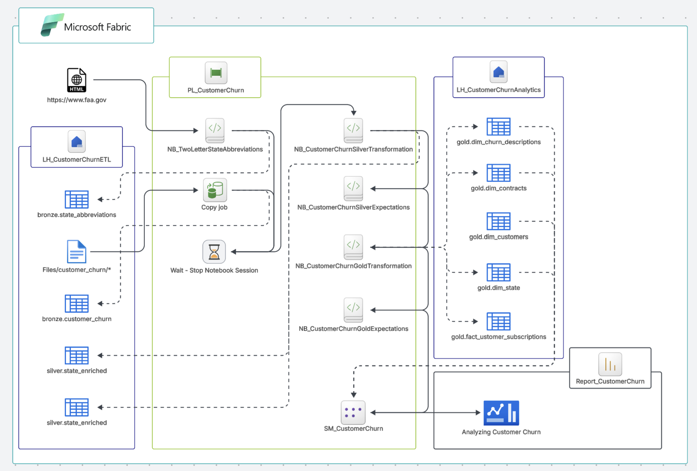

Berdasarkan data pipeline yang ditampilkan, pada proyek kali ini, proses ekstraksi hingga visualisasi data menggunakan Microsoft Fabric Free Trial dengan proses Extract, Load, dan Transform (ELT) menggunakan Medallion Architecture. Mulai dari Bronze Layer, proses ekstrasi lalu memuat file berekstensi .csv maupun teks html menjadi dua tabel yang terpisah berdasarkan sumber datanya. Berikut ini tabel informasi mengenai tabel hasil ekstrasi data.

| Nama data (tabel)                 | Pemilik                               | Sumber data       | Asal format data  | Ukuran    | Catatan                                       |
|-----------------------------------|---------------------------------------|-------------------|-------------------|-----------|-----------------------------------------------|
| [bronze].[customer_churn]         | Perusahaan                            | Local directory   | CSV file format   | ± 848KB   | Gabungan data langganan konsumen              |
| [bronze].[state_abbreviations]    | Federal Aviation Administration (FAA) | Website           | HTML text         | -         | Text html yang diekstrak melalui API request  |

Kemudian, Silver Layer, proses transformasi struktur tabel, seperti mengubah tipe data, mengubah nama kolom, mengubah urutan kolom, dan penambahan kolom, serta menggabungkan dua sumber data untuk penyelarasan logika bisnis. Kemudian, Gold Layer, proses transformasi data menjadi dimensional modeling - star schema yang terdiri dari tabel-tabel dimensi dan fakta yang siap digunakan untuk analsis. Tabel-tabel ini tersimpan dalam sebuah skema [LH_CustomerChurnAnalytics].[gold].

### 02-4 Penyimpanan Data Siap Analisis
Berikut ini informasi struktur tabel dari tabel-tabel dimensi dan fakta yang akan digunakan untuk analisis.

- Tabel dim_state
    - Kolom dan tipe data

    | Nama kolom    | Tipe data | Pengelompokkan tipe data              |
    |---------------|-----------|---------------------------------------|
    | State Key     | String    | Surrogate key                         |
    | State Code    | String    | Categorical data/Dimension attribute  |
    | State Name    | String    | Categorical data/Dimension attribute  |

- Tabel dim_contracts
    - Kolom dan tipe data

    | Nama kolom        | Tipe data | Pengelompokkan tipe data              |
    |-------------------|-----------|---------------------------------------|
    | Contract Key      | String    | Surrogate key                         |
    | Contract Type     | String    | Categorical data/Dimension attribute  |
    | Contract Category | String    | Categorical data/Dimension attribute  |
    | Payment Method    | String    | Categorical data/Dimension attribute  |

- Tabel dim_churn_descriptions
    - Kolom dan tipe data

    | Nama kolom        | Tipe Data | Pengelompokkan tipe data              |
    |-------------------|-----------|---------------------------------------|
    | Churn Key         | String    | Surrogate key                         |
    | Churn Reason      | String    | Categorical data/Dimension attribute  |
    | Churn Category    | String    | Categorical data/Dimension attribute  |

- Tabel dim_customers
    - Kolom dan tipe data

    | Nama kolom                                | Tipe data | Pengelompokkan tipe data              |
    |-------------------------------------------|-----------|---------------------------------------|
    | Customer Key                              | String    | Surrogate key                         |
    | Customer ID                               | String    | Natural key                           |
    | Phone Number                              | String    | Categorical data/Dimension attribute  |
    | Gender                                    | String    | Categorical data/Dimension attribute  |
    | Demographics                              | String    | Categorical data/Dimension attribute  |
    | Age                                       | Integer   | Continuous data/Dimension attribute   |
    | Age Bin                                   | Integer   | Continuous data/Dimension attribute   |
    | Is Contract Group                         | String    | Categorical data/Dimension attribute  |
    | Number of Customers in Group              | Long      | Continuous data/Dimension attribute   |
    | Is International Calls Active             | String    | Categorical data/Dimension attribute  |
    | Is International Plan                     | String    | Categorical data/Dimension attribute  |
    | Is Unlimited Data Plan                    | String    | Categorical data/Dimension attribute  |
    | Is Device Protection And Online Backup    | String    | Categorical data/Dimension attribute  |
    | Is Churn                                  | String    | Categorical data/Dimension attribute  |
    | Churn Flag                                | Integer   | Continuous data/Dimension attribute   |

- Tabel fact_customer_subscriptions
    - Kolom dan tipe data

    | Nama kolom                    | Tipe data | Pengelompokkan tipe data              |
    |-------------------------------|-----------|---------------------------------------|
    | Subscription Key              | String    | Surrogate key                         |
    | Customer Key                  | String    | Foreign key                           |
    | State Key                     | String    | Foreign key                           |
    | Contract Key                  | String    | Foreign key                           |
    | Churn Key                     | String    | Foreign key                           |
    | Grouped Consumption           | String    | Categorical data/Dimension |
    | Avg Monthly GB Download       | Long      | Continuous data/Measure               |
    | Local Calls                   | Long      | Continuous data/Measure               |
    | Local Mins                    | Double    | Continuous data/Measure               |
    | International Calls           | Long      | Continuous data/Measure               |
    | International Mins            | Double    | Continuous data/Measure               |
    | Customer Service Calls        | Long      | Continuous data/Measure               |
    | Account Length Months         | Long      | Continuous data/Measure               |
    | Monthly Charge                | Double    | Continuous data/Measure               |
    | Extra International Charges   | Double    | Continuous data/Measure               |
    | Extra Data Charges            | Double    | Continuous data/Measure               |
    | Total Charge                  | Double    | Continuous data/Measure               |
    | Loaded At                     | Timestamp | Date and timestamp data               |

    - Kolom referensi

    | Nama kolom referensi  | Tujuan kolom  | Tujuan tabel              |
    |-----------------------|---------------|---------------------------|
    | Customer Key          | Customer Key  | dim_customers             |
    | State Key             | State Key     | dim_state                 |
    | Contract Key          | Contract Key  | dim_contracts             |
    | Churn Key             | Churn Key     | dim_churn_descriptions    |

## 03 Visualizing Data
Data yang siap digunakan analisis, selanjutnya diproses menjadi semantic model dengan menentukan hubungan antar tabel-tabel dimensi dengan tabel fakta, membuat tabel pengukuran yang berisi kumpulan metrik untuk analisis, serta menentukan format penulisan dan tampilan data. Semantic model ini akan digunakan untuk visualisasi data dalam bentuk report. Berikut ini halaman-halaman yang terdapat dalam report sebagai hasil visualisasi data.

### 03-1 Halaman 1 - Overview
Halaman ini menganalisis metrik berupa customer churn beserta konteks yang mendeskripsikan temuan terkait konsumen yang berhenti berlangganan. Metrik yang ditampilkan adalah hasil penjumlahan maupun persentase dari jumlah tersebut. Konteks yang dideskripsikan meliputi pilihan masa berlaku paket langganan, kategori alasan berhenti berlangganan, negara bagian tempat konsumen tinggal, dan alasan berhenti berlangganan.

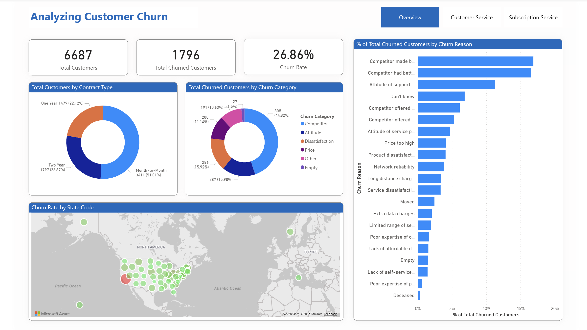

Halaman ini tidak memiliki filter yang diterapkan. Halaman ini hanya menampilkan Card untuk tampilan metrik dan Chart untuk tampilan metrik beserta konteksnya. Berikut ini informasi mengenai Card dan Chart yang divualisasikan pada halaman ini.

- Card:
    - Total Customers → jumlah keseluruhan konsumen.
    - Total Churned Customers → jumlah konsumen yang berhenti berlangganan.
    - Churn Rate → persentase jumlah konsumen yang berhenti berlangganan dibandingkan jumlah keseluruhan konsumen.

- Chart:
    - Total Customers by Contract Type → jumlah keseluruhan konsumen dan persentase bagiannya pada setiap pilihan masa berlaku paket langganan.
    - Total Churned Customers by Churn Category → jumlah konsumen yang berhenti berlangganan dan persentase bagiannya pada setiap kategori alasan berhenti berlangganan
    - Churn Rate by State Code → persentase jumlah konsumen yang berhenti berlangganan di setiap negara bagian.
    - % of Total Churned Customers by Churn Reason → pemeringkatan alasan berhenti berlangganan berdasarkan persentase bagiannya dari keseluruhan jumlah konsumen yang berhenti dan diurutkan mulai dari terbesar.

### 03-2 Halaman 2 - Customer Service
Halaman ini menampilkan analisis hubungan perusahaan sebagai penyedia layanan langganan dengan konsumen melalui layanan konsumen yang disediakan oleh perusahaan. Layanan konsumen yang tersedia meliputi panggilan layanan konsumen, metode pembayaran langganan, dan pilihan masa berlaku paket langganan sebagai periode kontrak konsumen menggunakan layanan langganan.

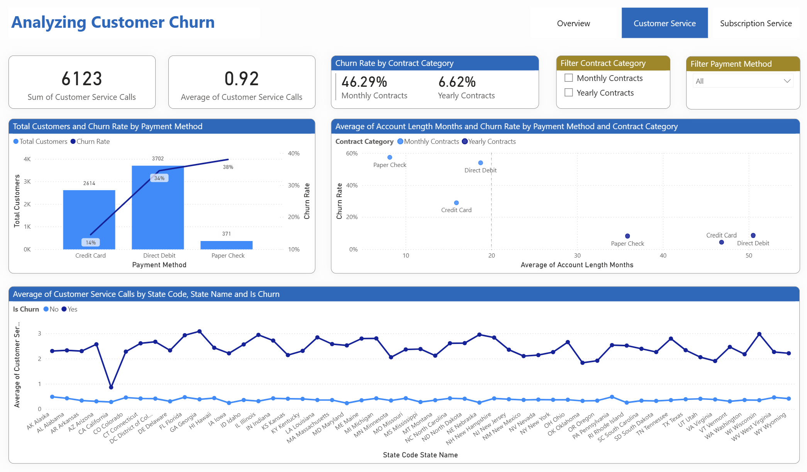

Filter diterapkan pada halaman ini untuk mempermudah navigasi konteks yang ingin ditampilkan. Filter tersebut meliputi:

- Filter:
    - Filter Contract Category → pilihan kategori kontrak yang dipilih konsumen, meliputi kontrak bulanan atau kontrak tahunan.
    - Filter Payment Method → pilihan metode pembayaran langganan yang disediakan oleh perusahaan, meliputi credit card, direct debit, dan paper check.

Selain itu, metrik maupun beserta konteks ditampilkan dalam bentuk Card maupun Chart di halaman ini, yaitu sebagai berikut:

- Card:
    - Total Customer Service Calls → jumlah keseluruhan panggilan layanan konsumen yang telah dilakukan.
    - Average of Customer Service Calls → rata-rata panggilan layanan konsumen dari keseluruhan konsumen.
    - Churn Rate by Contract Category → perbandingan tingkat persentase jumlah konsumen yang berhenti langganan antara kontrak bulanan dengan kontrak tahunan. 

- Chart:
    - Total Customers and Churn Rate by Payment Method → jumlah keseluruhan konsumen dan persentase bagiannya, serta tingkat persentase jumlah konsumen yang berhenti langganan pada setiap metode pembayaran yang digunakan.
    - Average of Account Length Months and Churn Rate by Payment Method and Contract Category → korelasi antara lama konsumen berlangganan dalam satuan bulan dengan tingkat persentase jumlah konsumen yang berhenti berlangganan berdasarkan kategori kontrak dan metode pembayarannya.
    - Average of Customer Service Calls by State Code and Is Churn → perbandingan rata-rata panggilan layanan konsumen antara konsumen yang berhenti berlangganan dengan konsumen yang tidak berhenti berlangganan di setiap negara bagian.

### 03-3 Halaman 3 - Subscription Service
Halaman ini digunakan untuk menganalisis perbandingan paket langganan yang ditawarkan perusahaan dengan penggunaan konsumen. Paket langganan yang ditawarkan meliputi paket data dan paket panggilan internasional. Analisis perbandingan dilakukan untuk menentukan apakah pilihan konsumen telah sesuai dengan kebutuhannya atau belum. Selain mengukur penggunaan paket langganan, metrik juga ditampilkan berupa harga ekstra yang perlu dibayar konsumen apabila tidak memilih paket langganan yang ditawarkan.

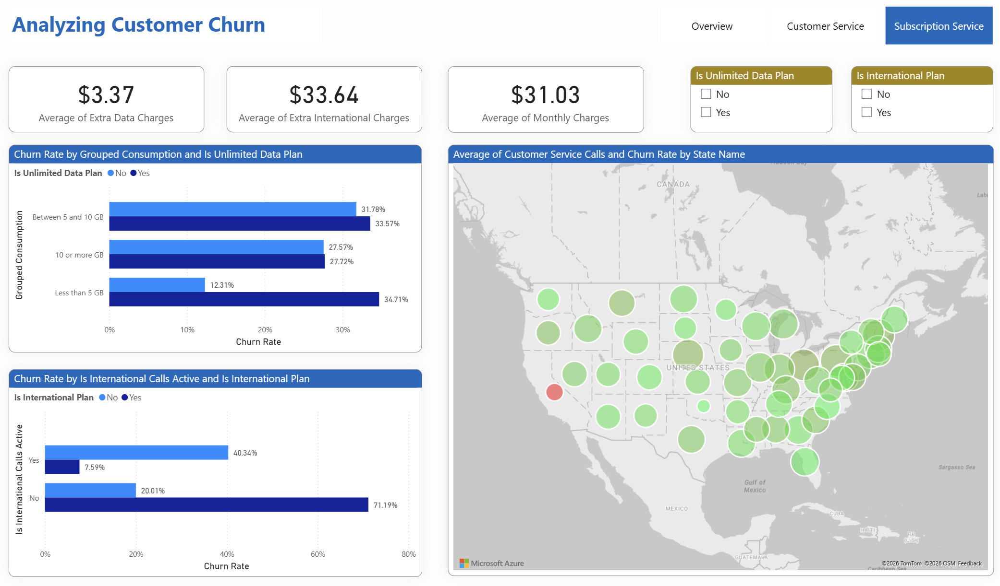

Halaman ini memiliki filter yang dapat diterapkan. Filter ini memudahkan dalam analisis perbandingan antara konsumen yang memilih paket langganan dengan konsumen yang tidak memilih paket langganan. Filter yang dimaksud adalah sebagai berikut:

- Filter:
    - Is Unlimited Data Plan → pilihan ya atau tidak konsumen memilih paket langganan data.
    - Is International Plan → pilihan ya atau tidak konsumen memilih paket langganan panggilan internasional.

Berikut ini Card dan Chart yang menampilkan metrik beserta kontesk dalam halaman ini.

- Card:
    - Average of Extra Data Charges → rata-rata harga ekstra penggunaan data yang perlu dibayar konsumen dalam mata uang dollar.
    - Average of Extra International Charges → rata-rata harga ekstra penggunaan panggilan internasional yang perlu dibayar konsumen dalam mata uang dollar.
    - Average of Monthly Charge → rata-rata harga yang perlu dibayar konsumen setiap bulannya dalam mata uang dollar.

- Chart:
    - Churn Rate by Grouped Consumption and Is Unlimited Data Plan → perbedaan tingkat persentase jumlah konsumen yang berhenti berlangganan antara setiap pengkategorian penggunaan data dengan pilihan ya atau tidak memilih paket langganan data.
    - Churn Rate by Is International Calls Active and Is International Plan → perbedaan tingkat persentase jumlah konsumen yang berhenti berlangganan antara pilihan ya atau tidak aktif menggunakan panggilan internasional dengan pilihan ya atau tidak memilih paket langganan panggilan internasional.
    - Average of Customer Service Calls and Churn Rate by State Code → persebaran rata-rata panggilan layanan konsumen dari keseluruhan konsumen dan tingkat persentase jumlah konsumen yang berhenti berlangganan di setiap negara bagian.

## 04 Analyzing Data
### 04-1 Descriptive Analytics

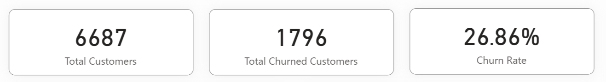

Berdasarkan pengamatan Card pada Halaman 1 - Overview, menunjukkan bahwa jumlah keseluruhan konsumen yang pernah berlangganan layanan perusahaan sebanyak 6687 konsumen dengan 1796 konsumen di antaranya atau sebesar 26,86% merupakan konsumen yang berhenti berlangganan. Hal ini menandakan kurangnya minat konsumen untuk berlangganan layanan yang saya di periode selanjutnya. 

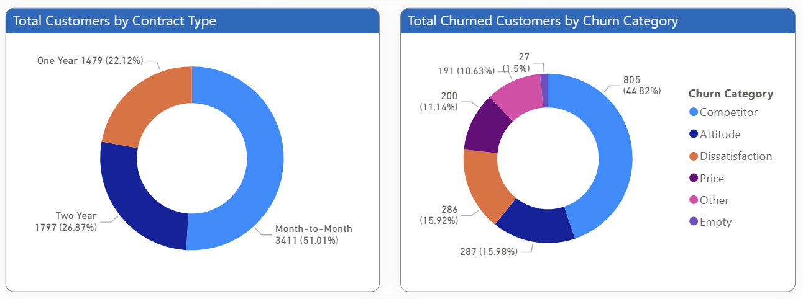

Perlu diperhatikan bahwa 51,01% dari keseluruhan konsumen yang lebih memilih periode kontrak dengan masa berlaku per bulan. Singkatnya masa berlaku paket langganan yang dipilih oleh konsumen menandakan konsumen masih memiliki keraguan untuk berencana memperpanjang paket langganannya minimal satu tahun. Hal ini diperkuat bahwa sebagian besar persentase alasan berhenti berlangganan dikategorikan sebagai kompetitor diikuti kategori kedua, yaitu sikap/respon. Hal ini menunjukkan adanya permasalahan internal dan eksternal yang perlu ditinjau lebih dalam. Permasalahan eksternal terkait kecenderungan konsumen untuk lebih memilih layanan langganan dari kompetitor. Sedangkan permasalahan internal berkaitan dengan sikap atau respon dari layanan konsumen sebagai jembatan hubungan konsumen dengan perusahaan.  

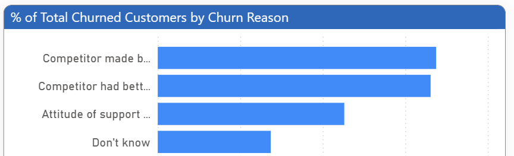

Apabila divalidasi kembali, kategori alasan konsumen berhenti berlangganan benar-benar sebagian besar terkait kompetitor dan sikap dengan tiga alasan berhenti yang bisa ditinjau lebih dalam, yaitu:
- Competitor made better offer.
- Competitor had better devices.
- Attitude of support person.

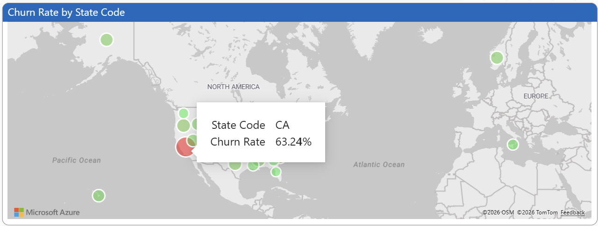

Selain itu, negara bagian yang memiliki tingkat persentase jumlah konsumen yang berhenti berlangganan paling tinggi sebesar 63,24% adalah California dengan kode CA. Berdasarkan hasil analisis ini, maka dapat dideskripsikan bahwa perusahaan telah kehilangan konsumen sebesar 26,86% atau lebih dari seperempat jumlah keseluruhan konsumen. Sebagian besar permasalahannya terkait layanan kompetitor dan sikap/respon layanan konsumen. Tingkat jumlah konsumen yang berhenti berlangganan paling tinggi terjadi di California. Informasi ini menjadi bahan pertimbangan melakukan analisis lebih lanjut untuk mengetahui penyebab layanan perusahaan mendapatkan banyaknya konsumen yang berhenti berlangganan.

### 04-2 Diagnostic Analytics
Berdasarkan uraian descriptive analytics, disebutkan bahwa terdapat permasalahan internal dan eksternal yang menyebabkan konsumen berhenti berlangganan. Permasalahan tersebut terkait kompetitor dan layanan konsumen. Selain itu, California menjadi negara bagian yang memiliki tingkat persentase jumlah konsumen yang berhenti berlangganan paling tinggi sebesar 63,24%. Hal ini menunjukkan lebih dari setengah konsumen yang berhenti berlangganan berada di negara bagian tersebut. Maka dari itu, analisis dilanjutkan untuk mengetahui lebih dalam penyebabnya berdasarkan permasalahan internal dan eksternal tersebut.

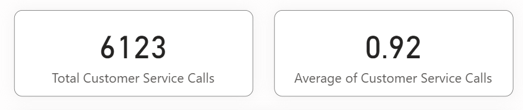

Mulai dari permasalahan internal, diketahui bahwa selama ini layanan konsumen mendapatkan panggilan sebanyak 6123 panggilan dengan rata-rata dari keseluruhan konsumen melakukan panggilan layanan konsumen sebanyak 0.92 panggilan atau hampir satu kali setiap konsumen bisa melakukan panggilan layanan konsumen. Hal ini menandakan kemungkinan konsumen setelah melakukan pembayaran masih mengalami permasalahan dalam menggunakan layanan.

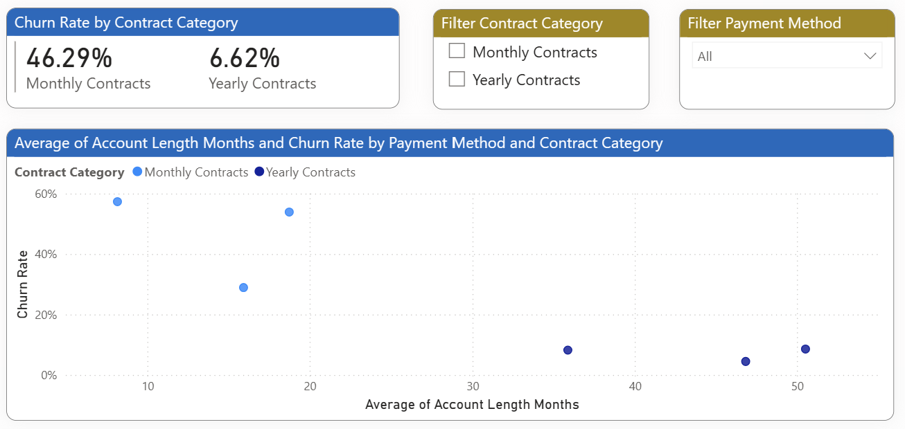

Kemudian, konsumen dengan lama berlangganan di bawah 20 bulan masih berpotensi berhenti berlangganan atau tidak melanjutkan ke dalam masa berlaku langganan yang lebih panjang (minimal satu tahun). Hal ini memperjelas bahwa pengalaman setahun pertama konsumen dalam menggunakan layanan perlu diperhatikan kembali agar konsumen tidak mengalami permasalahan lagi dalam menggunakan layanan dan memberikan kepercayaan konsumen untuk berlangganan tahunan.

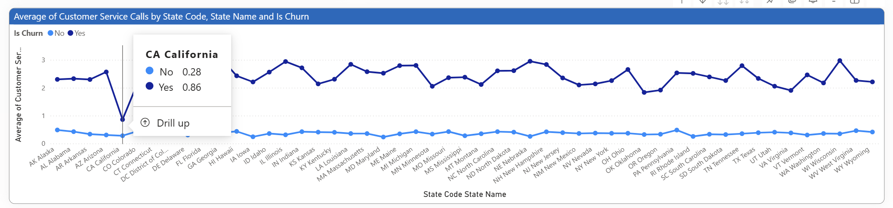

Apabila ditinjau lebih dalam terkait California sebagai negara bagian yang memiliki tingkat persentase paling tinggi, menunjukkan bahwa rata-rata jumlah panggilan layanan konsumen dari keseluruhan konsumen paling rendah dibandingkan dengan negara bagian lain. Berdasarkan informasi ini, maka permasalahan layanan konsumen tidak serta merta menjadi permasalahan utama yang dialami oleh konsumen di California, melainkan berpotensi lebih kecil kemungkinan untuk menemukan solusi melalui peninjauan layanan konsumen lebih dalam lagi. Oleh karena itu, penelusuran lebih lanjut penyebab sebagian besar konsumen berhenti berlangganan akan dilakukan dengan peninjauan lebih dalam terkait permasalahan eksternal, yaitu kompetitor. Akan tetapi, data yang dikumpulkan hanya memiliki informasi layanan perusahaan dan tidak memiliki informasi terkait layanan kompetitor yang digunakan oleh konsumen yang telah berhenti berlangganan. Oleh karena itu, peninjauan dilakukan lebih cenderung kepada layanan yang ditawarkan oleh perusahaan.

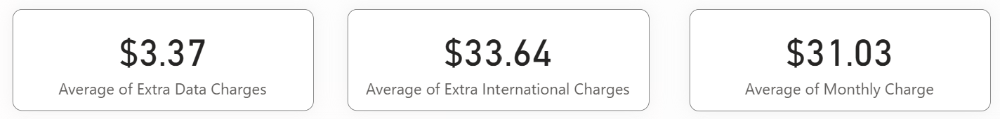

Berdasarkan tampilan Halaman 3 - Subscription Service, ditemukan bahwa penyebab konsumen dengan lama berlangganan di bawah 20 bulan berpotensi berhenti berlangganan berasal dari harga ekstra penggunaan panggilan internasional yang perlu dibayar lebih dari biaya bulanan yang harus dibayar konsumen. Rata-rata harga ekstra penggunaan panggilan internasional dari keseluruhan konsumen ini berjumlah 33,64 dollar lebih besar dibandingkan rata-rata biaya bulanan konsumen berjumlah 31,03 dollar. Hal ini menyebabkan konsumen cenderung beralih pada layanan penggunaan panggilan internasional yang lebih murah.

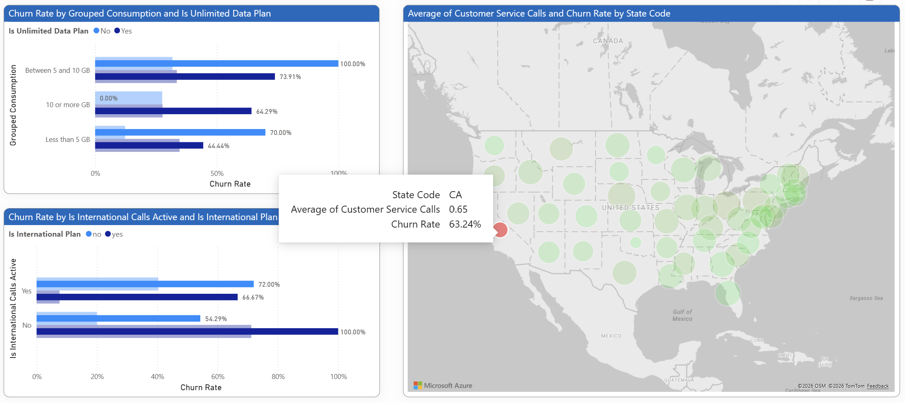

Apabila diamati lebih spesifik, negara bagian, seperti California dengan tingkat persentase jumlah konsumen berhenti berlangganan paling tinggi, ditemukan bahwa di California sebesar 72% merupakan konsumen yang berhenti berlangganan secara aktif melakukan panggilan internasional, tapi tidak memilih paket langganan panggilan internasional.

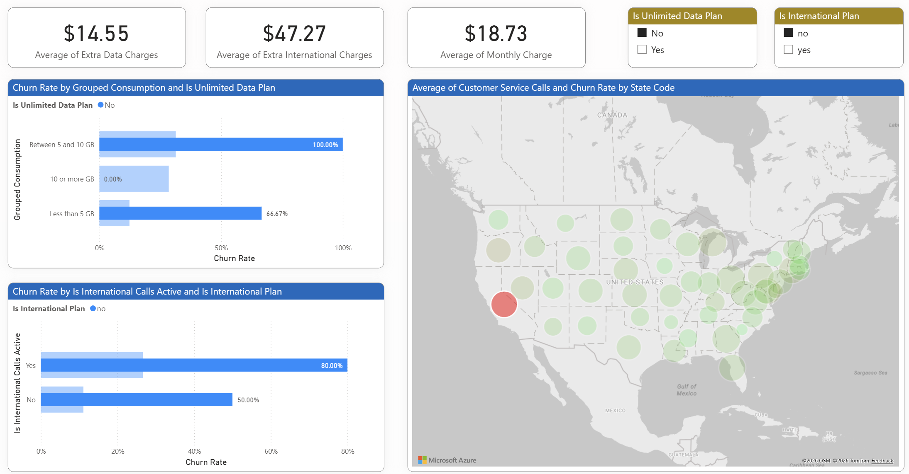

Apabila lebih spesifik pada konsumen bertempat tinggal di California dengan tidak mengambil paket langganan panggilan internasional dan paket langganan unlimited data, menunjukkan bahwa potensi konsumen tersebut berhenti berlangganan semakin besar. Hal ini dapat dilihat pada tingkat persentase jumlah konsumen yang berhenti berlangganan dengan tanpa memilih paket berlangganan apapun minimal sebesar 50%, bahkan sebesar 100% konsumen yang menggunakan paket langganan data antara 5 hingga 10 GB. Hal ini membuktikan bahwa kurangnya kesadaran konsumen untuk mendapatkan harga yang lebih hemat apabila memilih paket langganan yang ditawarkan tersebut. Selain itu, tidak ada paket langganan data yang menawarkan harga yang lebih murah apabila penggunaannya hingga 10 GB. Hasil penemuan inilah yang menjadi penyebab sebagian besar konsumen berhenti berlangganan.

Berdasarkan hasil penemuan ini, maka perusahaan dapat melakukan peningkatan layanan dengan melakukan kegiatan marketing, seperti pemberian notifikasi penawaran kepada konsumen yang berpotensi mendapatkan harga yang lebih murah apabila pada periode langganan berikutnya konsumen memilih paket langganan yang ditawarkan. Pemberian notifikasi ini dilakukan berdasarkan pada riwayat penggunaan layanan oleh masing-masing konsumen, seperti penggunaan data maupun keaktifan melakukan panggilan internasional. Selain itu, perusahaan juga dapat menawarkan paket langganan baru bagi konsumen dengan riwayat penggunaan data antara 5 hingga 10 GB agar konsumen tersebut mendapatkan harga yang lebih murah dibandingkan tanpa membeli paket langganan baru ini. Berkaitan dengan layanan konsumen, perusahaan dapat memulai memantau kendala yang dialami konsumen saat melakukan panggilan layanan konsumen agar permasalahan konsumen terkait layanan langganan bisa benar-benar teratasi dan tidak ada keluhan yang sama di kemudian hari.

## 05 Central Message
Perusahaan telekomunikasi penyedia layanan paket berlangganan data dan panggilan mengalami kehilangan konsumen dengan persentase jumlah konsumen yang berhenti berlangganan sebesar 26,86% atau lebih dari seperempat konsumen yang tidak berlangganan layanan perusahaan lagi. Negara bagian dengan persentase jumlah konsumen yang berhenti berlangganan tertinggi sebesar 63,24% adalah California. Hal ini menandakan bahwa sebagian besar konsumen yang berhenti berlangganan bertempat tinggal di California. Oleh sebab itu, perusahaan ingin meningkatkan layanannya.

Dengan analisis yang dilakukan, menunjukkan bahwa penyebab perusahaan kehilangan konsumennya berasal dari permasalahan internal maupun eksternal. Permasalahan internal berupa sebanyak 6123 panggilan layanan konsumen dengan rata-rata dari keseluruhan konsumen sebanyak 0,92 panggilan menyebabkan konsumen yang memilih langganan bulanan enggan memperpanjang langganannya secara tahunan. Sedangkan, permasalahan eksternal berupa tingginya harga ekstra penggunaan panggilan internasional yang perlu ditanggung oleh konsumen dengan rata-rata 33,64 dollar dibandingkan biaya bulanan yang perlu dibayar oleh konsumen dengan rata-rata 31,03 dollar. Permasalahan eksternal ini membuat konsumen beralih kepada layanan langganan dari kompetitor. Setelah mendalami penyebabnya, ternyata 80% hingga 100% jumlah konsumen yang berhenti berlangganan disebabkan karena ketidaksesuaian penggunaan konsumen dengan paket langganan yang ditawarkan oleh perusahaan.

Berdasarkan analisis tersebut, maka perusahaan dapat meningkatkan layanannya melalui kegiatan marketing, seperti pemberian notifikasi penawaran paket langganan yang relevan untuk periode langganan berikutnya kepada konsumen yang berpotensi mendapatkan harga yang lebih murah apabila memilih penawaran tersebut. Pemberian notifikasi ini dilakukan berdasarkan pada riwayat penggunaan layanan oleh masing-masing konsumen, yaitu terkait penggunaan data maupun keaktifan melakukan panggilan internasional. Selain itu, penambahan paket langganan baru dengan penawaran harga yang lebih murah kepada konsumen dengan penggunaan data antara 5 hingga 10 GB. Untuk jangka panjang, perusahaan sudah mulai memantau kendala yang dialami konsumen saat melakukan panggilan layanan konsumen agar permasalahan konsumen terkait layanan bisa benar-benar teratasi dan tidak ada kendala yang sama di kemudian hari.